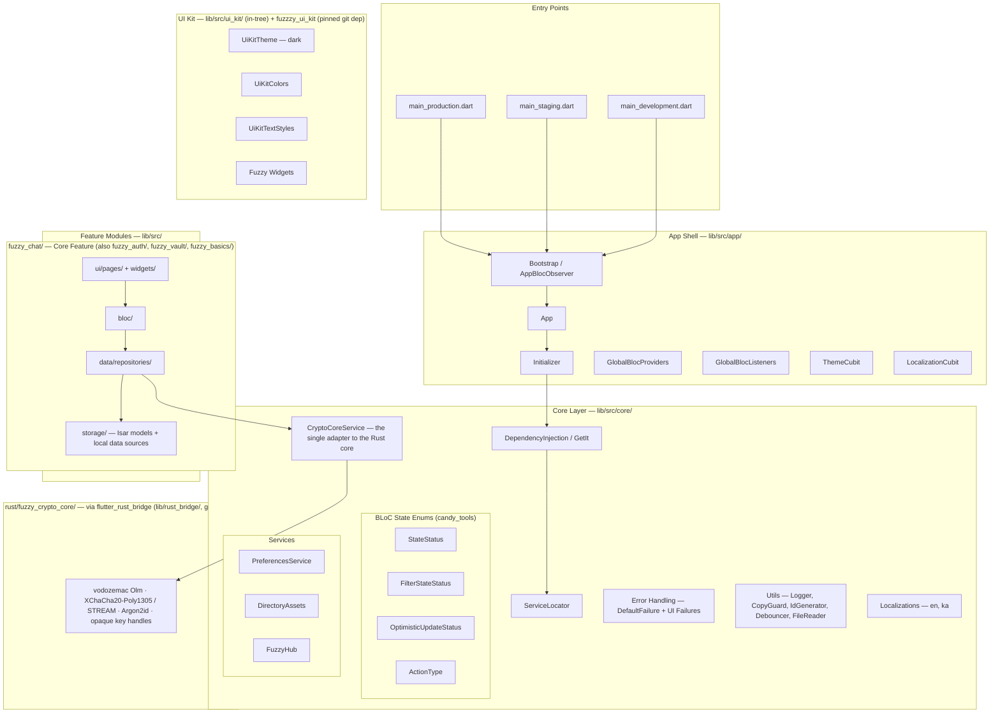
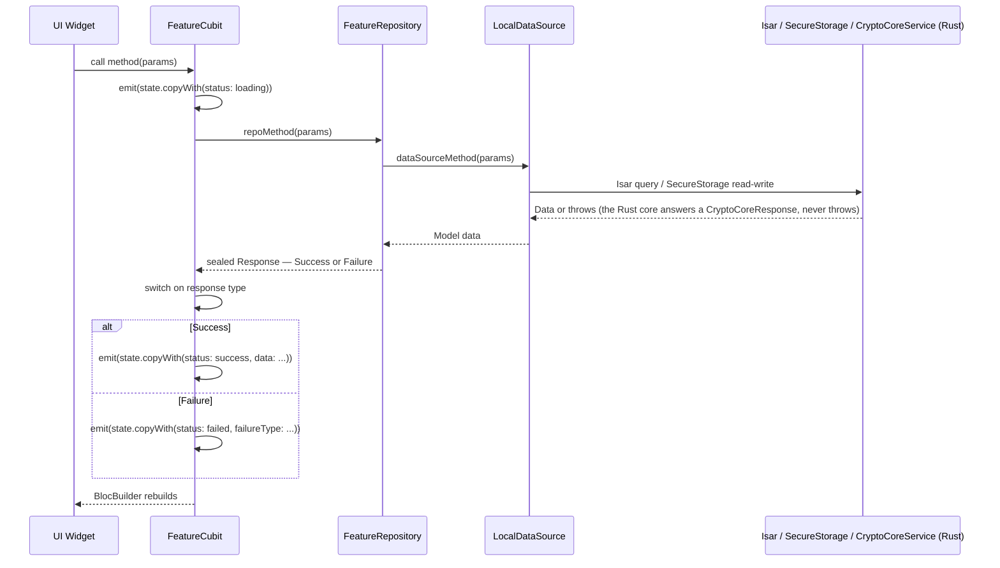

# Fuzzy Chat — Architecture & Standards Guide

> This is the canonical, production-grade architecture and standards document for **Fuzzy Chat**. All AI personas MUST adhere to these rules without exception. This is the single source of truth for "how we build things."

---

## 1. High-Level System Design

### Critical Context: Fuzzy Chat is 100% Offline

Fuzzy Chat has **NO remote API, NO HTTP client, NO server connectivity**. All data lives on-device. The "network" is the user manually copy-pasting encrypted text or sharing encrypted files via external channels.

### Visual Map — System Architecture


### Data Flow — Feature Operation Lifecycle


---

## 2. Directory Structure & Module Responsibilities

```
fuzzy_chat/
├── lib/
│   ├── lib.dart                        # THE import: `export 'src/src.dart';`
│   ├── main_development.dart           # Flavor entry points (development = Marionette-instrumented)
│   ├── main_staging.dart
│   ├── main_production.dart
│   ├── rust_bridge/                    # GENERATED by flutter_rust_bridge_codegen — never edit, analyzer-excluded
│   └── src/
│       ├── src.dart                    # Feature barrel
│       ├── app/                        # App Shell: Routing, Theme, Globals, Init, MainShellPage
│       ├── core/                       # Core: DI, CryptoCoreService (bridge adapter), Errors, Services, Utils, l10n
│       ├── fuzzy_chat/                 # Core feature: chats, pairing, messages, files, safety number
│       ├── fuzzy_auth/                 # App lock: store-key password + biometrics
│       ├── fuzzy_vault/                # Encrypted vault: notes, passwords, files
│       ├── fuzzy_basics/               # Standalone password-only encryption tool
│       └── ui_kit/                     # In-tree design-system pieces (+ the fuzzzy_ui_kit git dep)
├── rust/fuzzy_crypto_core/             # The crypto core (Rust crate; api/ = the frb surface)
├── rust_builder/                       # frb plugin shell + vendored cargokit — builds the crate per platform
├── documents/security/                 # PROTOCOL.md, THREAT_MODEL.md, RELEASE.md, HARDENING_2026.md, vectors/, sbom/
└── scripts/                            # Python utility scripts
```

---

## 3. Feature Folder Structure (Canonical Pattern)

Every feature module MUST follow this structure. This is non-negotiable.

### 3.1. Layers within a Feature (`lib/src/<feature_name>/`)
-   **`data/models/`**: Plain Dart data classes. Naming: `<Name>Data` for domain models.
-   **`data/repositories/`**: Facade over local data sources. **MUST** catch all exceptions and return a Sealed Class response.
-   **`storage/`**: 
    -   `storage_models/`: Isar collection classes (with `.g.dart` generated files).
    -   `local_data_sources/`: Direct Isar/SecureStorage access. Service Locator (`sl.get()`) is permitted here.
-   **`bloc/`**: Cubits and their immutable State classes. Takes repository via constructor injection. State file uses `part of`.
-   **`ui/`**: `pages/` (route destinations) and `widgets/` (feature-specific widgets).

### 3.2. Barrel Files & `./exp.sh` (MANDATORY)
Every directory MUST have a barrel file (`<dir_name>.dart`) that exports its children. After creating any new `.dart` files, the user **MUST** be reminded to run `./exp.sh` to automatically update this entire barrel chain. Failure to do so will result in compilation errors.

---

## 4. Architectural Patterns & Rules

### 4.1. BLoC/Cubit & Repository Contract
-   **Repositories NEVER throw exceptions.** They return Sealed Classes (`Success | Failure`). This is the most important rule.
-   **Cubits NEVER use `try/catch`.** They use exhaustive `switch` on the sealed response.
-   **State MUST be immutable.** Use `copyWith`.
-   State status is tracked via `StateStatus` enum (`initial`, `loading`, `success`, `failed`).

### 4.2. Dependency Injection (GetIt)
-   **Constructor Injection is MANDATORY** for Repositories and Cubits.
-   **Service Locator (`sl.get<T>()`) is ONLY permitted** in the `local_data_sources/` layer (for DB access) and at the top level when providing a BLoC. It is forbidden in Widgets, Repositories, and Cubits.

### 4.3. UI Kit & Theming
-   **NEVER** use `Color()`, `Colors.`, `TextStyle()`, or hardcoded numbers for spacing/padding.
-   **ALWAYS** use theme extensions from the `BuildContext`: `context.uiColors`, `context.uiTextStyles`.
-   **ALWAYS** prefer widgets from `ui_kit/` (`FuzzyScaffold`, `FuzzyButton`, `FuzzyHeader`) over native Flutter widgets.

### 4.4. Error Handling Protocol (Offline)
1.  **Local Data Source Level:** Data sources interact with Isar/SecureStorage. They may let storage exceptions bubble up.
2.  **Repository Level:** The repository wraps the data source call in a `try/catch` block. It catches ALL exceptions and translates them into a `Failure` object within its sealed response.
3.  **Cubit Level:** The cubit receives the `Failure` object and maps it to a `StateStatus.failed` state, passing along a specific `FailureType` enum.
4.  **UI Level:** The UI uses status builders to react to `StateStatus.failed` and display appropriate error feedback.

### 4.5. Offline-Only Rule (CRITICAL)
-   **NEVER** introduce HTTP clients, API calls, or remote data sources.
-   **NEVER** add dependencies that require network connectivity.
-   All data operations are local: Isar DB, SecureStorage, SharedPreferences, local file system.

---

## 5. Cryptography Stack

The app's core value is its cryptography, and **none of it is written in Dart**. It lives in the Rust crate `rust/fuzzy_crypto_core` and reaches Dart only through `flutter_rust_bridge` 2.13.0:

| Layer | Where | Purpose |
|---------|---------|---------|
| `CryptoCoreService` | `lib/src/core/encryption_services/crypto_core_service/` | The single adapter: owns the `CryptoCore` handle, maps every Rust `CoreError` to `CryptoCoreResponse` (`CryptoCoreSuccess | CryptoCoreFailure`), serialises Argon2id calls. **The only `lib/` importer of `package:fuzzy_chat/rust_bridge/…`** (plus `initializer.dart`; in `test/`, only `helpers/crypto_core_test_init.dart` and `src/core/rust_bridge_smoke_test.dart`). |
| `lib/rust_bridge/` | generated | `api/{core,pairing,files,passwords,vault,formats,health}.dart` (messages, safety and local seals are methods on `CryptoCore` in `core.dart`) + `error.dart` + `frb_generated*.dart` — codegen output, committed, never edited |
| `rust/fuzzy_crypto_core/src/api/` | Rust | The frb surface; keys stay in `#[frb(opaque)]` handles (`CryptoCore`, `VaultKey`, `FileJob`) |
| Crates | `Cargo.toml`, `=`-pinned + `Cargo.lock` | `vodozemac` (Olm), `chacha20poly1305` + `aead-stream` (AEAD, STREAM), `argon2` (Argon2id), `hkdf`/`sha2`, `subtle`/`zeroize`/`getrandom` |

Rules: no primitive, KDF, MAC or protocol by hand; no key bytes across the bridge; no `#[frb(sync)]` on anything touching keys or an AEAD; every blob starts `FUZZ 01 <type>`; state is persisted before a result is returned. The specification is `documents/security/PROTOCOL.md`; the state of the Dart side is `.agents/project_guide/architecture_state.md` §6. Change the surface → `flutter_rust_bridge_codegen generate` → commit the generated files (`lessons_learned.md` FN-009).

---

## 6. Scripts & Code Generation

| Script | Purpose | Usage |
|--------|---------|-------|
| `./exp.sh` | Regenerate all barrel files | Run after creating any new `.dart` file |
| `./loc.sh` | **BROKEN** — see `.agents/workflows/scripts_reference.md` (hand-edit both `.arb` files + `fvm flutter gen-l10n`) | Add localization entries |
| `./m.sh` | **BROKEN** — see `.agents/workflows/scripts_reference.md` (`python3 scripts/merge_contents.py <dir>`) | Merge file contents for AI context |
| `./buildrunner.sh` | **BROKEN** — see `.agents/workflows/scripts_reference.md` for the Isar codegen recipe | After modifying Isar models |
| `flutter_rust_bridge_codegen generate` | Regenerate `lib/rust_bridge/` + `frb_generated.rs` | After any change under `rust/fuzzy_crypto_core/src/api/` |
| `cargo test --locked` / `cargo build --release --locked` | Rust tests / the core `flutter test` loads | From `rust/fuzzy_crypto_core/` |

---

## 7. Linter & Formatting
The project uses `very_good_analysis` ^5.1.0 with disabled rules for practicality (80-char line limit, cascade invocations, etc.); `lib/rust_bridge/**`, `rust_builder/**`, `**/*.g.dart`, `l10n/**` and `code_generators/**` are analyzer-excluded. The [REVIEWER] persona must run `fvm flutter analyze` and `fvm dart format --output=none --set-exit-if-changed lib test` (never a bare `dart format .` — it rewrites files and descends into `rust_builder/`) as part of its process; for Rust changes also `cargo fmt --check`, `cargo clippy --all-targets --locked -- -D warnings` and `cargo test --locked`.
