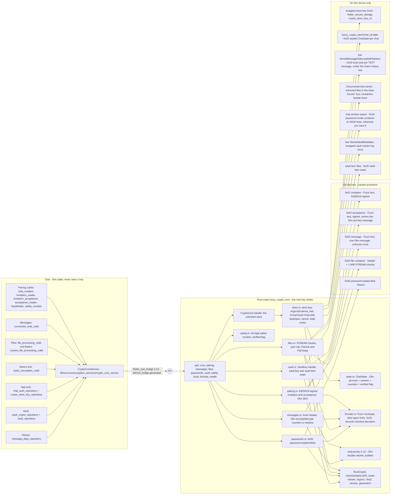
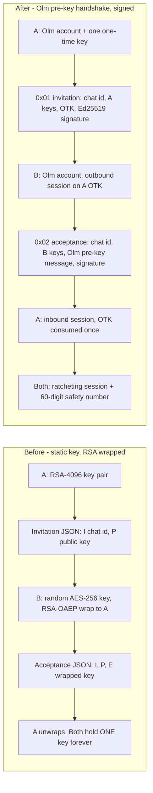
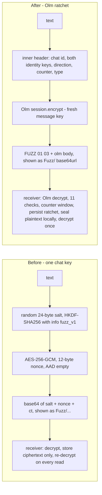
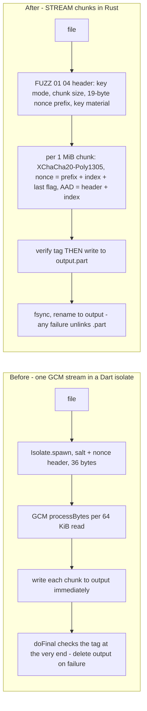

# Fuzzy Chat — what changed in the encryption, and why (for the owner)

**Written:** 2026-09-13 · **Compares:** the app as you left it at commit `5090f2c` (branch
`feat/message-length-manager`) with the hardened app at `df7dab6` on `agent/chat-harden-rust-crypto-core`, refreshed in the closing pass for
the three features that landed after it (F2-12 per-chat history key `820d38d`, F2-10 archive export `d2a2f15`,
F2-11 trade-off copy `57ad6d4`/`f88774b`) · **Owner decision that asked for this:** D-10
(`flow/fuzzy-chat-hardening/OWNER_DECISIONS.md`).

This is the bridge from the app *you* built to the app that exists now. It is written for you, not for an auditor:
[`PROTOCOL.md`](PROTOCOL.md) and [`THREAT_MODEL.md`](THREAT_MODEL.md) already exist for them, and
[`HARDENING_2026.md`](HARDENING_2026.md) is the public write-up. Every claim below points at a file (old paths are
given as `5090f2c:path`, readable with `git show 5090f2c:<path>`; new paths are links into this branch) or at a log
in the studio repository (`flow/fuzzy-chat-hardening/log/F*.md`, abbreviated `log/F*.md`). Where the work quotes one of
your nine original findings, it is quoted as you wrote it in `plans/fuzzy_chat_hardening_prompt.md`.

**Contents:** 1 Summary · 2 Mind-map · 3 Before → after, component by component · 4 What did not change ·
5 Glossary · 6 Decisions · 7 Numbers · 8 Where to look

---

## 1. One-page summary

**What you had.** A pure-Dart encryption stack you wrote on a vendored copy of PointyCastle 4.0.0
(`5090f2c:packages/pointycastle`, 441 files). Pairing was RSA-4096 with OAEP: the inviter published an RSA public
key in a JSON invitation (`I` = chat id, `P` = public key), the accepter generated one random AES-256 key for the chat,
RSA-wrapped it to the inviter and sent it back in the acceptance (`E`), and from then on every text and every file in
that chat was AES-256-GCM under a per-message HKDF-SHA256 subkey of that one key
(`5090f2c:lib/src/core/encryption_services/{handshake_service,rsa_service,aes_service}`). The app lock and the vault
were Argon2id passwords verifying an AES-GCM token; the vault held its Argon2id output as the master key and
re-encrypted every item on a password change; Basics turned a passphrase into an AES key with a bare SHA-256. The
ideas were right — a fresh subkey per message, `AESEngine` rather than the timing-vulnerable fast engine, RSA-4096
with e = 65537 — and the brief says so. The problems were structural: one long-lived key per chat (F-1), nothing
authenticating the pairing (F-2), empty associated data (F-3), no counters (F-4), decrypted file bytes written to disk
before the tag was checked (F-5), a non-standard OAEP (F-6), a fork nobody synced (F-7), key material in Dart
`String`s that cannot be wiped (F-8), and 1.2 MB/s on a Mac (F-9).

**What you have.** One Rust crate, [`rust/fuzzy_crypto_core`](../../rust/fuzzy_crypto_core/src/lib.rs), reached
through `flutter_rust_bridge` 2.13.0, holding every key; Dart became a thin caller that never sees one. Nothing
cryptographic was written by hand: pairing and per-message keys are Matrix's Olm double ratchet (`vodozemac` 0.10.0,
audited by Least Authority in 2022), every other seal is XChaCha20-Poly1305 from RustCrypto (audited by NCC Group in
2020), files use the published STREAM construction in 1 MiB chunks, passwords go through Argon2id, and every artifact —
pasted blob, file container, state file, wrapped key — starts with `FUZZ 01 <type>`. A blob now unfuzzes exactly once,
on the device it was meant for; the pairing blobs are Ed25519-signed and a 60-digit safety number lets two people
confirm nobody sat in the middle; a tampered or truncated file is refused before one byte reaches the disk; and the
same 1 GB file that took about fourteen minutes takes about two seconds. All nine findings are closed; the old code is
deleted, not wrapped (commit `d4f7ce4`, 479 files, 172 627 lines), and an independent reviewer re-ran the greps.

**Why each piece moved, in one sentence each.** Pairing moved to Olm because a static key can never give forward
secrecy and vodozemac's audited 3DH + ratchet does, with Ed25519 signatures and the safety number closing F-2 on the
way. Messages moved onto the ratchet for F-1, gained an inner header for F-3 and a per-direction counter window for F-4.
Files moved to STREAM chunks so that F-5 (unverified plaintext on disk) and F-9 (speed) were fixed by the same design.
The app lock and vault stopped keeping a *verification token* and started keeping a *wrapped key*, because unwrapping
the key is the password check and it means a password change re-wraps 32 bytes instead of re-encrypting everything.
Basics moved from SHA-256-of-passphrase to Argon2id-sealed `0x05` blobs so a guessed passphrase costs an attacker
64 MiB and four passes per try. Key storage moved into Rust because Dart structurally cannot wipe a `String` (F-8).
PointyCastle went because F-6 and F-7 were both about it, and there was no longer anything left for it to do. One
product consequence needed your decision and got it: readable **text** history stays on the device, sealed at rest
under a per-chat key (D-1); unfuzzed **files** are plain files in the chat's folder, as before; and a chat's history can
leave the device only as a password-sealed archive you export yourself.

---

## 2. Mind-map — the app's crypto today

Read it left to right: the screens you know call the same cubits they always did; the cubits call **one** Dart
service; the service crosses the FFI into **one** Rust crate; the crate is the only thing that ever holds a key;
and everything that leaves the crate is either a `Fuzz/` blob, a sealed file, or the plaintext you asked for.

Three things to hold on to from the picture:

1. **The Dart side lost every algorithm and kept every name.** `HandshakeCubit`, `ConnectedChatCubit`,
   `FileProcessingCubit`, `ChatAuthRepository`, `VaultCryptoRepository` are still the entry points; what they call
   changed from four Dart services (`AESService`, `RSAService`, `HandshakeService`,
   `PasswordBasedEncryptionService`) to one adapter, `CryptoCoreService`, whose methods return the same
   sealed `Success`/`Failure` shape the vault already used.
2. **There is exactly one place keys live**: the Rust `CryptoCore` handle. Dart holds it by reference. Closing it
   (app lock) wipes it; every later call answers `StoreLocked`.
3. **Every artifact starts with `FUZZ 01 <type>`.** Whether it is pasted text, a file on a USB stick, the state
   file on disk or the wrapped key in the keychain, the first six bytes say what it is and which version wrote
   it. A future format change is a new version byte, never a silent reinterpretation.

---

## 3. Before → after, component by component

Each table: what you had at `5090f2c`, what is there now, why it moved (your finding or a review item), and what
you will notice in the app. "Not visible" means the screen looks and behaves as before.

### 3.1 Chat pairing

Your finding, as written: **F-2 — Unauthenticated handshake.** *"No fingerprint / safety-number / SAS comparison
anywhere. `README.md` warns the user in prose to verify out-of-band. Prose is not a control."* And **F-6 —
Non-standard OAEP.** *"`rsa_service_impl.dart` calls `OAEPEncoding(RSAEngine())` … RSAES-OAEP v2.0 (RFC 2437) … also
`OAEPEncoding.withSHA1` — SHA-1 MGF1, not SHA-256."*

| Aspect | Before (`5090f2c`) | After (`df7dab6`) | Why | What you notice |
|---|---|---|---|---|
| Long-term keys | One RSA-4096 pair per chat (`rsa_service_impl.dart:5` `_bitStrength = 4096`, e = 65537, Miller-Rabin certainty 100), generated in `chat_creation_cubit.dart:35-50` | One Olm `Account` per chat per device: Ed25519 signing key + Curve25519 identity key + exactly one one-time key ([`pairing.rs`](../../rust/fuzzy_crypto_core/src/pairing.rs), [`PROTOCOL.md` §3](PROTOCOL.md#3-key-material-per-chat)) | F-1: a static wrapped key cannot give forward secrecy; F-6/F-7: OAEP and its library go with it | Not visible — chat creation still takes one tap |
| Invitation | JSON `{"I": base64(chatId), "P": base64(json{modulus, publicExponent})}` (`handshake_service.dart:9-26`); no version, no signature | Binary `FUZZ 01 01 ‖ chat_id ‖ A_curve25519 ‖ A_ed25519 ‖ one_time_key ‖ Ed25519 sig`, 203 bytes, shown as `Fuzz/` + base64url ([`PROTOCOL.md` §6.3](PROTOCOL.md#63-invitation-0x01)) | F-2 (signed), plus the brief's rule that every wire format carries magic + version from day one | The invitation code looks different (starts with `Fuzz/`); pasting garbage says "This invitation is invalid or damaged" instead of throwing |
| Who makes the chat key | The **accepter** generated the AES key (`invitation_acceptance_cubit.dart:46` `AESService.generateKey()`) and RSA-wrapped it into `E` (`:48`) | Nobody: keys come out of the X25519 triple-DH on both sides; B's acceptance carries an Olm pre-key message, not a key ([`PROTOCOL.md` §4.3](PROTOCOL.md#43-acceptance-b-and-the-handshake-message)) | F-1 | Not visible |
| Acceptance | JSON `{"I", "P", "E"}`; the inviter trusted whatever `P`/`E` arrived (`handshake_cubit.dart:40-47`); re-reading it re-wrapped the key so `E` differed every time (`acceptance_reader_cubit.dart:34-43`) | `FUZZ 01 02 ‖ chat_id ‖ B_curve25519 ‖ B_ed25519 ‖ len ‖ prekey_msg ‖ sig`; A verifies the signature, then the chat id, then builds the inbound session, then checks the decrypted handshake header before anything is written ([`PROTOCOL.md` §4.4](PROTOCOL.md#44-completion-a-and-one-time-key-consumption)) | F-2; review item "checks before save" (11 dishonest headers keep the one-time key — `api::pairing::tests::wrong_inner_header_is_corrupt_and_keeps_the_otk`) | The acceptance is stable (re-display shows the same code); a second paste says "This invitation was already used"; a code from another chat says "This code belongs to a different chat" |
| Authenticating the person | README prose ("make super sure the Acceptance code you get back is from the person you actually intended") | 60-digit safety number over both Ed25519 keys + chat id, a "Verify safety number" page, a shield in the chat header, a persisted verified flag ([`safety.rs`](../../rust/fuzzy_crypto_core/src/safety.rs), [`safety_number_page.dart`](../../lib/src/fuzzy_chat/ui/pages/safety_number_page/safety_number_page.dart), [`chat_header.dart`](../../lib/src/fuzzy_chat/ui/pages/connected_chat_page/widgets/chat_header.dart)) | F-2; D-2 chose the number over vodozemac's emoji SAS | **New screen** after the handshake, a shield icon beside the chat name (outline until you mark it verified) |
| Signing | `RSAService.sign/verify` existed (PKCS#1 v1.5, SHA-256) but nothing in `lib/` called it — only tests did (`rsa_service_impl.dart:63-81`) | Every pairing blob ends in a 64-byte Ed25519 signature over every preceding byte, envelope included ([`PROTOCOL.md` §4.1](PROTOCOL.md#41-signatures)) | F-2 | Not visible |
| Regenerating a pending invitation | Not possible without recreating the chat | `create_invitation` on a pending chat replaces the account; the old invitation can never complete ([`PROTOCOL.md` §4.2](PROTOCOL.md#42-invitation-a-and-regeneration)) | Review follow-up | Not visible unless used |

### 3.2 Messages

Your findings: **F-1 — No forward secrecy.** *"`handshake_service.dart` establishes one long-lived symmetric key per
chat, RSA-wrapped in the acceptance blob. One device compromise decrypts the entire history and every future
message."* **F-3 — Empty AAD.** *"`aes_service_impl.dart` passes `Uint8List(0)` as associated data."* **F-4 — No
replay or ordering protection.** *"No sequence numbers anywhere. A captured blob can be re-sent and will decrypt
cleanly, forever."*

| Aspect | Before | After | Why | What you notice |
|---|---|---|---|---|
| Key per message | HKDF-SHA256(chat key, salt 24 random bytes, info `fuzzVersionInfo` = `"ZnV6el92MQ=="` = base64 of `fuzz_v1`) → a fresh AES-256 subkey (`aes_service_impl.dart:126-143`, `default_constants.dart:6-19`). The good idea the brief told us to keep. | The Olm double ratchet: a fresh message key per blob from a chain that ratchets on every direction change; the receiver deletes the key on use and persists that before returning plaintext ([`messages.rs`](../../rust/fuzzy_crypto_core/src/messages.rs), [`PROTOCOL.md` §14](PROTOCOL.md#14-the-forward-secrecy-argument)) | F-1 — same "one key per message" property, plus forward secrecy | A blob unfuzzes **once** on one device; pasting it again says "This message was already unfuzzed on this device" |
| Cipher | AES-256-GCM, `GCMBlockCipher(AESEngine())`, 12-byte nonce, 128-bit tag (`aes_service_impl.dart:4-7, 113`) | Olm v1 as vodozemac ships it: AES-256-CBC + HMAC-SHA256 truncated to 8 bytes per message, inside the ratchet ([`PROTOCOL.md` §4](PROTOCOL.md#4-pairing); the 8-byte MAC is discussed in [`THREAT_MODEL.md` §7.5](THREAT_MODEL.md#75-the-8-byte-olm-v1-mac--and-why-no-forgery-oracle-exists-here)) | The brief: use the audited protocol unmodified, invent nothing | Not visible |
| Associated data | `Uint8List(0)` (`aes_service_impl.dart:120`) | An **inner header** inside the Olm plaintext: version, chat id, sender and recipient Ed25519 keys, direction byte, 64-bit counter, content type — checked field by field on receipt ([`PROTOCOL.md` §7.1–7.2](PROTOCOL.md#71-layout)) | F-3 | A blob from chat A pasted into chat B fails (at the MAC, then again at the header) |
| Replay / ordering | None; any old blob decrypted forever | Olm's consumed-key store plus a per-direction 64-bit counter window: seen → `Replay`, more than 63 behind the newest accepted → `TooOld` ([`counters.rs`](../../rust/fuzzy_crypto_core/src/counters.rs), [`PROTOCOL.md` §8.2](PROTOCOL.md#82-the-counter-window-this-protocol)) | F-4 | Two new messages: "already unfuzzed" and "too old to unfuzz — too many newer messages were unfuzzed first" |
| Wire format | Std base64 of `salt(24) ‖ nonce(12) ‖ ct ‖ tag` (`aes_service_impl.dart:30`), prefixed `Fuzz/` **in the UI** (`sent_message_area.dart:30`, `connected_chat_page.dart:149-155` decided encrypt-vs-decrypt by `startsWith('Fuzz/')`) | `Fuzz/` + base64url(no pad) of `FUZZ 01 03 ‖ olm_type ‖ olm_body`; whitespace inside is ignored so e-mail wrapping does not break a paste; **no chat id, counter or sender in the clear** ([`PROTOCOL.md` §6.1, §6.5](PROTOCOL.md#65-message-0x03)) | Format-versioning rule; metadata minimisation | The `Fuzz/` prefix you already had is now part of the protocol, not just UI sugar |
| History | Isar `StoredMessageData` kept only `encryptedMessage`; `MessageData.fromStored` set `decryptedMessage = ''` and `connected_chat_cubit.dart:106-120` re-decrypted every text row on page load | The **text** plaintext is sealed once (`0x20` local seal) into the new `StoredMessageData.sealedPlaintext` column and opened on read; nothing is re-decrypted. File rows carry no seal: an unfuzzed file is an ordinary file in `Documents/<chat name>/` and the row holds its path ([`message_data_repository.dart`](../../lib/src/fuzzy_chat/data/repositories/message_data_repository/message_data_repository.dart), [`PROTOCOL.md` §10.4–10.5](PROTOCOL.md#104-local-seal-of-message-history)) | The ratchet makes re-decryption impossible; a sender cannot decrypt its own output either | Chat history looks the same; it loads without a decrypt per row. Unfuzzed files are where they always were, in the clear |
| History key | — | **One random 32-byte key per chat per device** (F2-12, `820d38d`): drawn from the OS CSPRNG at pairing, at the same moment as the chat's Olm account, stored only inside that chat's sealed `.state` file, and destroyed with the chat. It seals text rows only. It is random-with-the-account rather than derived from the identity secret because vodozemac exposes no accessor for that secret; the effect you asked for — one chat's key opens no other chat's history, and the two sides' keys are unrelated — holds ([`PROTOCOL.md` §3, §10.4](PROTOCOL.md#104-local-seal-of-message-history)) | Your D-1 answer: defence in depth, app-lock password stays the outer gate. Honestly: it bounds a leaked *history key* to one chat; whoever has the *store key* or your app-lock password still opens every chat | Not visible. Deleting a chat makes its old rows unreadable for good |
| Sending order | Encrypt, then store, then emit | Encrypt (ratchet persisted first), store the sealed row, **then** emit — `connected_chat_cubit.dart` comment at the store call | Review: a crash between steps must not lose a counter | Not visible |
| Archive export | — (history could only be copied message by message) | **"Export chat archive"** in a chat's settings (F2-10): asks for a password (weak and fair ones are refused), writes a password-mode `0x04` container whose plaintext is one JSON line per message (`direction`, `sentAt`, `text` or `fileName` — never file bytes — or `unreadable: true`); desktop saves where you choose, mobile hands it to the share sheet. Opens in Basics → file decryption with the same password; **no import** — it is a backup you can read, not a state transfer ([`PROTOCOL.md` §9.5](PROTOCOL.md#95-chat-archive-export-per-chat), [`THREAT_MODEL.md` R35](THREAT_MODEL.md#10-residual-risks-and-open-questions)) | D-1's "password-protected archive export"; the only way history leaves the device now that OS backups are off | New entry in chat settings; the exported file is outside the app's forward secrecy — its safety is your password |
| Trade-off copy | The README's "make super sure" prose | An onboarding slide, a notice on chat-creation success, an **About encryption** page under Settings, and the README bullet (F2-11): each blob unfuzzes once on this device; a blob more than 63 messages behind can no longer be unfuzzed; a new device or fresh install cannot re-read old blobs and there is no cloud copy; text history is sealed per chat under a key only this device holds; unfuzzed files are plain files; "Copy as link" carries the chat id; biometric unlock keeps the password in the OS keystore; the store does not lock itself. English + Georgian (the 19 Georgian strings await your native read — `HANDOFF.md`) | D-1 / D-7: say it in the app, not only in the threat model | Onboarding has one more slide; Settings has "About encryption" |

### 3.3 Files

Your findings: **F-5 — File decryption releases unverified plaintext.** *"`_processChunks` streams the whole file as a
single GCM blob and writes decrypted chunks to disk before the authentication tag is checked at the very end."*
**F-9 — Pure-Dart bulk crypto is unusably slow.** *"AES-256-GCM, 16 MB: 13.3 s → 1.2 MB/s … A 1 GB file takes
~14 minutes to encrypt in this app and ~0.15 s natively."*

| Aspect | Before | After | Why | What you notice |
|---|---|---|---|---|
| Container | `salt(24) ‖ nonce(12)` then one continuous GCM stream (`aes_service_impl.dart:215-216, 335-347`); extension `.fuzz` (`default_constants.dart:4`) | `FUZZ 01 04` header (chat mode: chunk size, nonce prefix, an Olm message carrying the file key and original name; password mode: salt + Argon2id parameters) then `n` chunks of `ct ‖ tag` ([`PROTOCOL.md` §6.6, §9.1](PROTOCOL.md#66-file-container-0x04)) | F-5, format rule | Still `.fuzz`; the receiver now gets the **original file name** out of the container |
| Chunking | Dart's default 64 KiB reads, all one cipher stream; the whole GCM input is buffered by PointyCastle internally | 1 MiB chunks (decoder accepts 64 KiB..16 MiB), each its own AEAD with the chunk index in nonce and AAD and an explicit last-chunk flag ([`files.rs`](../../rust/fuzzy_crypto_core/src/files.rs)) | F-5: truncation, reordering, duplication and appended bytes are all detected | Not visible |
| Tag before write | Decrypted bytes written as they came (`aes_service_impl.dart:311`), tag checked in `doFinal` at the end (`:324`), partial output deleted only on error, **not on cancel** (`:317`) | A chunk is written only after its tag verifies, into `<out>.part` (mode 0600); rename on success; a drop guard unlinks `.part` on error, cancel or panic ([`PROTOCOL.md` §9.3](PROTOCOL.md#93-the-part-rule-and-jobs); tests `tamper_leaves_no_partial_output`, `truncated_*`, `appended_bytes_detected`, `reordered_or_duplicated_chunks_detected`) | F-5 | A damaged file leaves **nothing** on disk; the message is "This file cannot be opened; ask the sender to send it again" |
| Where it runs | `Isolate.spawn(fileEncryptionIsolateEntry, …)` per file, pause = 100 ms polling loop in the isolate (`aes_service.dart:56-60`, `aes_service_impl.dart:280-285`) | frb's thread pool; a `FileJob` atomic control word read before every chunk (pause = 50 ms poll, cancel terminal); progress one event per chunk ([`api/files.rs`](../../rust/fuzzy_crypto_core/src/api/files.rs)) | F-9 | Pause / resume / cancel behave as before; progress is per MiB |
| Speed | 1.2 MB/s (the brief) | 583 / 587 MB/s Mac release; 440–460 MB/s emulator with 4 GB (§7) | F-9 | A 1 GB file: ~14 min → ~2 s |
| File key (chat) | The chat's one AES key, HKDF'd per file | 32 random bytes per file, sealed in **one Olm message** in the header — every file costs one ratchet step and has the same forward secrecy as a text ([`PROTOCOL.md` §9.4](PROTOCOL.md#94-chat-mode--the-file-key-rides-in-one-olm-message)) | F-1 for files | A file container also unfuzzes once; a second attempt says "already unfuzzed" |
| Two-step receive | — | `prepare_file_receive` (Olm step under the store lock, spends the message) → `FileTicket` → `run_file_job` (streams, no lock). The cubit first checks the input size is stable for 500 ms so a still-downloading file does not spend its message ([`file_processing_cubit.dart`](../../lib/src/fuzzy_chat/bloc/file_processing_cubit/file_processing_cubit.dart)) | Review: text sends must not wait behind a running file job; a corrupt chat file consumes its message ([`THREAT_MODEL.md` §7.8](THREAT_MODEL.md#78-a-corrupt-chat-mode-file-consumes-its-message)) | New copy: "This file is still being written — wait until it has fully arrived, then try again" |
| Memory | Whole-input buffering in PointyCastle's GCM | One reused chunk buffer: 3.9 MB peak RSS over a 1 GiB file (`log/F3-1.md` §5) | F-9 | Large files no longer grow the process |

### 3.4 App lock

| Aspect | Before | After | Why | What you notice |
|---|---|---|---|---|
| Password check | Argon2id(password, salt 24 B) → key; a random 32-byte token AES-GCM-encrypted under it; `chat_auth_salt` + `chat_auth_verification_token` in secure storage; decrypting the token = correct password (`chat_auth_repository.dart:26-63`) | The **wrapped store key** (`0x10` blob, AAD `store-key`) *is* the verifier: `open_store` unwraps it or answers `WrongPassword`; no token, no separate salt entry ([`api/core.rs`](../../rust/fuzzy_crypto_core/src/api/core.rs), [`PROTOCOL.md` §10.2](PROTOCOL.md#102-store-key-lifecycle)) | One artifact instead of two; the key you unlock is the key you use | Not visible |
| Argon2id parameters | `ARGON2_id`, iterations 4, memory 65 536 KiB, **lanes 4**, 32-byte output (`password_based_encryption_service_impl.dart:53-58`); ran in `Isolate.run` | Argon2id m = 65 536 KiB, t = 4, **p = 1**, 32 bytes; parameters written into every header; caps of 256 MiB / 16 passes on anything read ([`PROTOCOL.md` §11](PROTOCOL.md#11-password-formats)) | Same cost class; parameters in the header let a future build change them without a format bump; caps stop a hostile blob from OOM-killing a phone | Unlock: 0.13 s Mac, ~1 s emulator profile |
| What the password protects | Each chat's RSA private key and AES key, **each** separately PBE-wrapped under the password string with a fresh Argon2id salt (`key_storage_repository.dart:11-23, 65-74`); the password itself lived in `FuzzyAuthStore.state.authData.password` and was read on every key access (`:12, 32, 66`) | One 32-byte store key, wrapped once; every chat's state file and history seal hangs off it; the password is used at unlock and then only the Rust handle exists ([`crypto_store_key_repository.dart`](../../lib/src/fuzzy_chat/data/repositories/crypto_store_key_repository/crypto_store_key_repository.dart), secure-storage key `crypto_store_key_v1`) | F-8; one Argon2id per unlock instead of one per key | Not visible |
| Lock off | Password `''`; every key Argon2id-wrapped under the empty string (`key_storage_repository.dart:12, 66`) | Store key wrapped under `''` the same way; `isChatAuthEnabled` = "does `open_store('')` succeed", the preference is a cache repaired from the blob ([`chat_auth_repository.dart`](../../lib/src/fuzzy_auth/data/repositories/chat_auth_repository.dart)) | Review R1 (F2-6): the blob is the truth | Not visible |
| Password change | Verify old → `reencryptAllKeys` over every chat (two-phase staging in secure storage, `key_storage_repository.dart:115-144`, recovery at boot `dependency_injection.dart:76`) → new token | `rewrap_store_key`: unwrap under old, wrap under new, one secure-storage write; nothing else on disk changes ([`api/core.rs`](../../rust/fuzzy_crypto_core/src/api/core.rs)) | Nothing is keyed by the password any more | Two Argon2id runs: 260 ms Mac / 6.7 s emulator, with a "Re-securing your keys…" overlay (D-9); snackbar "Chat Password Changed" |
| Lock | Keys stayed in Dart memory as `Uint8List`s / `String`s | `CryptoCore.close()` zeroises the store key and every cached state; later calls answer `StoreLocked` | F-8 | Not visible |
| Biometrics | `biometric_storage` holds the plaintext password (`biometric_auth_repository.dart:48-62`) | **Unchanged** — stated in [`THREAT_MODEL.md`](THREAT_MODEL.md) R20 and accepted in D-7 | Pre-existing design, out of this build's scope | Not visible |

### 3.5 Vault

| Aspect | Before | After | Why | What you notice |
|---|---|---|---|---|
| Master key | The Argon2id output itself, used directly as the AES key; salt + AES-GCM verification token in `VaultMetadata` (`vault_crypto_repository.dart:19-61`) | A random 32-byte master key, wrapped `0x10` with AAD `vault-key` (never confusable with the store key's `store-key`), stored in `VaultMetadata.verificationToken`; unlocking returns an opaque `VaultKey` handle ([`vault.rs`](../../rust/fuzzy_crypto_core/src/vault.rs), [`PROTOCOL.md` §10.6](PROTOCOL.md#106-vault)) | F-8; role separation of wrapped keys (F4-1 review) | Not visible |
| Items | AES-GCM under the master key, optional **outer** PBE layer for a custom password (`:63-98`) — the reverse of what `.tasks/secure_personal_info/05_security_design.md` said | `0x20` seal under the master key with AAD `vault-item`, optional outer `0x05` password seal — same layering as your code had ([`vault_crypto_repository.dart`](../../lib/src/fuzzy_vault/data/repositories/vault_crypto_repository.dart)) | Reuse-first: the layering you shipped was kept, the primitives swapped | A wrong vault password shows "Incorrect password" (T-0332 fixed a raw enum name in that snackbar) |
| Password change | Derive new key, decrypt and re-encrypt **every item** (`reencryptAll`, `:147-164`) through a `.staging/` + `.committed` two-phase commit (`vault_repository.dart:446-541`) — and `reencryptAll` decrypted with the master key directly, so it would have thrown on any custom-password item | `vault_rewrap` on the 103-byte blob only; items untouched; the staging machinery (−81 lines in `vault_file_data_source.dart`) deleted (`log/F4-2.md` §1) | Master key never changes, so nothing needs re-sealing; the bug above disappears with the code | Instant; nothing to recover at boot |
| Lock | `fillRange(0, len, 0)` on the `Uint8List` (`vault_auth_cubit.dart:201-214`) | `VaultKey.close()` zeroises in Rust; `dispose()` frees the handle | F-8 | Not visible |
| Metadata | `masterSaltBase64` field | Field removed (the salt lives inside the `0x10` blob) — one of the two Isar field changes | — | Not visible |

### 3.6 Basics (stand-alone text and files)

| Aspect | Before | After | Why | What you notice |
|---|---|---|---|---|
| Key from passphrase | `sha256(utf8(passphrase))` used directly as the AES-256 key — no salt, no stretching (`basic_encryption_cubit.dart:14-18`, `custom_file_processing_cubit.dart:122-124`, via the undeclared `crypto` package) | Argon2id(passphrase, random 16-byte salt, m 64 MiB, t 4, p 1) → key; salt and parameters recorded in the blob ([`passwords.rs`](../../rust/fuzzy_crypto_core/src/passwords.rs), [`PROTOCOL.md` §6.7](PROTOCOL.md#67-password-sealed-blob-0x05)) | A guessed passphrase now costs 64 MiB × 4 passes per try instead of one SHA-256 | Fuzzing a Basics text takes a visible fraction of a second (the Argon2id run) |
| Text blob | Same `salt ‖ nonce ‖ ct` base64 as chat messages | `FUZZ 01 05 ‖ salt ‖ m ‖ t ‖ p ‖ nonce ‖ ct ‖ tag`, AAD = the blob's own first 31 bytes; shown as `Fuzz/…` | F-3 for Basics; format rule | Wrong passphrase: "Incorrect key — this text cannot be unfuzzed with it." |
| Files | Same isolate path as chat files with the SHA-256 key | Password-mode `0x04` container (`key_mode 0x02`): Argon2id salt + parameters in the header, then STREAM chunks; no store needed, works while the app is locked | F-5, F-9 | Same pause/resume/cancel; "Wrong password — this file cannot be unfuzzed with it." |

### 3.7 Key storage — what sits where

| Aspect | Before | After | Why | What you notice |
|---|---|---|---|---|
| Per chat | `privateKey_<id>` (PBE-wrapped JSON of decimal `n, d, p, q, e` — `rsa_service_impl.dart:85-92`; a value starting with `{` was accepted as **plaintext JSON**, `key_storage_repository.dart:36-39`), `publicKey_<id>` (plaintext JSON), `symmetricKey_<id>` (PBE-wrapped), `otherPartyPublicKey_<id>` (plaintext JSON) — all in `flutter_secure_storage` with default options | One sealed file `fuzzy_crypto_store/<chat_id>.state` (`0x20`, AAD `chat-state ‖ chat_id`) holding the Olm account, session, counters, verified flag and the last blob for re-display; written atomically (tmp → fsync → rename → dir fsync), mode 0600 ([`store.rs`](../../rust/fuzzy_crypto_core/src/store.rs), [`PROTOCOL.md` §10.3](PROTOCOL.md#103-sealed-per-chat-state-files)) | F-8 — *"Dart `String`s are immutable and GC-managed: these cannot be zeroised"*; durability of counters | Not visible |
| Per chat, inside the state file | — (the chat's AES key was the only per-chat secret) | The Olm account and session **and the chat's 32-byte history key** (F2-12) — all inside the one sealed `.state` file, so the store key protects them together; nothing per chat lives in secure storage any more | D-1: one key per chat, destroyed with the chat | Not visible |
| Per device | `chat_auth_salt`, `chat_auth_verification_token`, `key_migration_status`, `key_migration_chat_ids`, `staged_*` | **One** entry: `crypto_store_key_v1` = the wrapped store key, with `IOSOptions`/`MacOsOptions(accessibility: unlocked_this_device)` (`default_constants.dart`; dev flavour uses the login keychain so unsigned builds run) | One secret to protect; `ThisDeviceOnly` keeps it out of backups (D-8) | Not visible |
| In Dart memory | RSA private key maps, AES keys as `Uint8List`, the app-lock password in Bloc state | No key bytes at all — four opaque handles (`CryptoCore`, `VaultKey`, `FileTicket`, `FileJob`); passwords still arrive as Dart `String`s (the residual the threat model states as R19) | F-8 | Not visible |
| Dead schema | Isar `StoredChatSecurityData {chatId, invitationFilePath, acceptanceFilePath, encryptedSymmetricKey}` registered but never read or written | Collection deleted with its 1 322-line `.g.dart` | Orphan of the change | Not visible |
| Randomness | `Random.secure()` one byte at a time (`secure_bytes_generation.dart:4-7`); RSA keygen `FortunaRandom` seeded from it | `getrandom::fill` (the OS CSPRNG) is the crate's only randomness source; vodozemac draws its own keys the same way ([`PROTOCOL.md` §3](PROTOCOL.md#3-key-material-per-chat)) | Fewer moving parts; `secure_bytes_generation.dart` deleted in F4-4 | Not visible |

### 3.8 Deep links

| Aspect | Before | After | Why | What you notice |
|---|---|---|---|---|
| Invitation / acceptance link | `fuzzylink://invite/<base64url(json)>` with `{v, t, I, P, exp}`; acceptance adds `E` (`fuzzy_link_generator.dart:11-31` at `5090f2c`) | Same scheme and hosts; the payload is `{v, t, b, exp}` where **`b` is the whole opaque `Fuzz/` blob** ([`fuzzy_link_generator.dart`](../../lib/src/core/services/fuzzy_link/fuzzy_link_generator.dart)); the handler routes with `peek_chat_id` (unauthenticated hint; the real check is inside `accept_invitation`/`complete_handshake`) | The link is a carrier, not a format of its own — one place to get the bytes right | Links still expire after 24 h; old `I/P` links are rejected by the parser (`test/src/core/services/fuzzy_link/*`) |
| Message link | `fuzzylink://fuzz/…` with `{v, t, c: chatId, m: ciphertext}` | **Unchanged** — `c` stays by D-7 (the blob itself carries no chat id; the link needs one to route) | Owner decision | Not visible |

### 3.9 Randomness and KDF

| Aspect | Before | After | Why |
|---|---|---|---|
| CSPRNG | `dart:math` `Random.secure()`, byte by byte; PointyCastle `FortunaRandom` for RSA | `getrandom` 0.4 (OS RNG) for nonces, salts, keys; vodozemac's own `rand`/`getrandom` for Olm keys | One audited source, no reseeding logic of ours |
| Password hashing | Argon2id via PointyCastle (m 64 MiB, t 4, **p 4**) | `argon2` 0.6.0, Argon2id (m 64 MiB, t 4, **p 1**), one entry point `derive_kek`, one run in flight process-wide, the 64 MiB block wiped after each run, parameters authenticated in every header, caps on read ([`PROTOCOL.md` §11](PROTOCOL.md#11-password-formats)) | RustCrypto, RFC 9106; the caps and the lock came from the F2-4 and F4-1 reviews |
| Key derivation | HKDF-SHA256 per message with `fuzz_v1` info (good — carried forward as the ratchet's job) | None of our own: per-message derivation is Olm's (HKDF inside vodozemac's ratchet); the per-chat history key is drawn at random, not derived (F2-12), so the crate's own `hkdf` dependency was removed in the closing pass | The ratchet subsumes the per-message subkey |
| Passphrase → key (Basics) | Bare SHA-256 | Argon2id as above | See §3.6 |
| Constant-time compares | — | `subtle::ConstantTimeEq` for identity-key checks | Auditor expectation |

### 3.10 Libraries — exact versions

| Role | Before (`5090f2c`) | After (`df7dab6`) |
|---|---|---|
| Symmetric / AEAD | PointyCastle **4.0.0**, vendored `packages/pointycastle` (441 files, no upstream tracking) — AES-GCM | `chacha20poly1305` **0.11.0** (XChaCha20-Poly1305) + `aead-stream` **0.6.0** (STREAM) — RustCrypto |
| Ratchet / pairing | PointyCastle RSA-4096 OAEP (SHA-1 MGF1) | `vodozemac` **0.10.0** (Olm v1, `default-features = false`) — Matrix; brings `ed25519-dalek` 2.2.0, `x25519-dalek` 2.0.1, `curve25519-dalek` 4.1.3 |
| Password hashing | PointyCastle Argon2 | `argon2` **0.6.0** |
| Hash / KDF | PointyCastle `SHA256Digest`, `HKDFKeyDerivator`; `package:crypto` 3.0.7 (transitive, imported directly by Basics) for SHA-256 | `sha2` **0.11.0** (the safety number's SHA-512). No KDF crate of our own: Argon2id is `argon2`, per-message keys are Olm's, the history key is random — `hkdf` was dropped once F2-12 left it callerless |
| Randomness | `dart:math` `Random.secure()`, `FortunaRandom` | `getrandom` **0.4.3** |
| Hygiene | — | `zeroize` **1.9.0**, `subtle` **2.6.1** |
| Encoding | `dart:convert` base64 / JSON | `base64` **0.22.1** (url-safe, no pad) on the wire; `serde`/`serde_json` 1.0.229 / 1.0.151 for the state-file body only |
| Bridge | — | `flutter_rust_bridge` **2.13.0** (Rust crate, Dart package and codegen in lockstep) |
| Toolchain | Flutter 3.41.7 / Dart 3.11.5 | same, plus Rust **1.98.1** (`rust-toolchain.toml`) |
| Pinning | `pubspec.lock` | `pubspec.lock` + `Cargo.lock`, CI builds `--locked`; the five crypto/FFI crates `=`-pinned in `Cargo.toml`; 19 byte-exact vectors fail `cargo test` if any dependency changes a byte ([`PROTOCOL.md` §15](PROTOCOL.md#15-reference-crates-and-versions)) |
| Removed from `pubspec.yaml` | — | `pointycastle` (path dep); `analysis_options.yaml` exclude of `packages/pointycastle/**`; `crypto` was never a direct dep and is now only transitive |
| Added to `pubspec.yaml` | — | `flutter_rust_bridge: 2.13.0`, `fuzzy_crypto_core: {path: rust_builder}`, `marionette_flutter ^0.6.0` (+ `marionette_mcp` dev) for QA |

Sources: `5090f2c:pubspec.yaml`, `5090f2c:packages/pointycastle/pubspec.yaml`, [`Cargo.toml`](../../rust/fuzzy_crypto_core/Cargo.toml), `log/F1-2.md` "Versions", `log/F4-4.md` §1–2.

### 3.11 Things in the old code you may not have known were there

Found while reading `5090f2c` for this comparison. None survived the rewrite; they are listed so the "before" column is
honest and so you can recognise the same patterns elsewhere.

| What | Where at `5090f2c` | Why it matters |
|---|---|---|
| OAEP with SHA-1 | `rsa_service_impl.dart:40, 52` — `OAEPEncoding(RSAEngine())` is PointyCastle's default constructor (SHA-1 MGF1) | Your F-6; deleted with RSA |
| Signing existed but was never used | `rsa_service_impl.dart:63-81` (`RSASigner(SHA256Digest(), …)`); callers only in `test/src/core/utils/rsa_manager/` | The tool for F-2 was in the tree, unwired |
| Plaintext private-key fallback | `key_storage_repository.dart:36-39`: a stored value starting with `{` was read as unencrypted JSON; `reencryptAllKeys` had `allowLegacyPlainJson: true` | A legacy path that would have kept unencrypted keys valid forever |
| Password in Bloc state, read per key access | `fuzzy_auth_cubit.dart` (`authData.password`), `key_storage_repository.dart:12, 32, 66, 77` | F-8 in a second form; now the password is used once at unlock |
| `AESServiceDebugExpose` in production code | `aes_service_impl.dart:358-381` (fixed salt/nonce encryption, `@visibleForTesting` but public in `lib/`) | Deleted with the service |
| Cancelled file jobs left partial plaintext behind | `aes_service_impl.dart:317-330` — the cancel path skipped `doFinal` and the delete-on-error helper | Part of F-5; the `.part` drop guard now covers cancel |
| Vault re-encrypt would fail on custom-password items | `vault_crypto_repository.dart:147-164` decrypted every item with the master key directly, but custom-password items had an outer PBE layer (`:84-92`) | The whole staged password change would have rolled back; gone with the rewrap design |
| Vault design doc contradicted the code | `.tasks/secure_personal_info/05_security_design.md:98-117` (master key outer, 16-byte salt) vs `vault_crypto_repository.dart:19, 84-92` (custom password outer, 24-byte salt) | The code's layering was kept; the doc is superseded by `PROTOCOL.md` §10.6 |
| Dead Isar collection | `StoredChatSecurityData` (registered in `dependency_injection.dart:40`, never read or written) | Deleted |
| Dead UI with unencrypted key files | `lib/stash/**` (11 files, 1 125 lines) used the file-based `KeysRepository` that wrote `private_key.json` unencrypted into the documents directory; `send_page.dart:44` RSA-encrypted raw message bytes | Not routed or exported; deleted in F4-4 |
| Basics: SHA-256 as the KDF | `basic_encryption_cubit.dart:14-18`, `custom_file_processing_cubit.dart:122-124`, importing `package:crypto` which was not a declared dependency | Now Argon2id (§3.6) |
| Argon2id lanes = 4 | `password_based_encryption_service_impl.dart:58` | Now p = 1 (the OWASP default for Argon2id); same memory and passes |
| A test tested a different KDF than shipped | `test/src/core/utils/aes_manager/ephemeral_key_derivation_test.dart:11-29` reimplemented HKDF with `salt: null, info: nonce`; production used `salt: salt, info: fuzzVersionInfo` | Replaced by 19 byte-exact vectors generated through the production code |
| File messages stored their absolute output path as `encryptedMessage` | `chat_file_injector_cubit.dart:48-56` | Unchanged and out of scope; noted in `THREAT_MODEL.md` §7.4 (metadata) |
| `technical_documentation.md` said nothing about the crypto | `5090f2c:documents/technical_documentation.md` — flavours, UI-kit override, a JDK note | `documents/security/` now exists |

---

## 4. What did NOT change

The build followed the studio's reuse-first rule (`company/PRACTICES.md`): new code had to look like it was always
part of the project, and only what the task required was touched. Concretely:

| Area | State | Evidence |
|---|---|---|
| **Screens and routes** | Every route from `5090f2c` is still there (`/`, `/onboarding`, `/chat-unlock`, `/chat/create`, `/chat/invitation`, `/chat/accept`, `/chat/acceptance-export`, `/chat/connected`, `/settings`, `/auth`, `/basics`, `/vault`, `/vault/editor`). **One** route added: `/chat/verify` (the safety-number page). Two redirect lines changed: a `fuzzylink://` URI goes to the link handler, and the boot window before the store opens is gated like "locked" (T-0328, T-0329). | `git diff 5090f2c..df7dab6 -- lib/src/app/app_router.dart` (+17/−1) |
| **Cubit and state class names** | All nine `fuzzy_chat` cubit directories at `5090f2c` exist with the same class names (`HandshakeCubit`, `InvitationAcceptanceCubit`, `InvitationReaderCubit`, `AcceptanceReaderCubit`, `ChatCreationCubit`, `ConnectedChatCubit`, `FileProcessingCubit`, `ChatFileInjectorCubit`, `ChatGeneralDataListCubit`). Two added: `SafetyNumberCubit`, `FileBenchmarkCubit` (dev flavour only). State classes kept; three failure fields moved from `DefaultFailure?` to typed failures (`ChatCreationFailure?`, `ConnectedChatFailure?`, `FileProcessingFailure?`). | `ls lib/src/fuzzy_chat/bloc` vs `git ls-tree 5090f2c lib/src/fuzzy_chat/bloc/`; `log/F2-7.md`, `log/F2-8.md`, `log/F3-3.md` §1 |
| **Isar collections** | Seven collections, six untouched. Exactly two field changes: `StoredMessageData.sealedPlaintext` **added** (`String?`, `null` for file rows); `StoredVaultMetadata.masterSaltBase64` **removed**. One dead collection deleted outright: `StoredChatSecurityData` (never read or written at `5090f2c`). No migration — pre-launch. | [`stored_message_data.dart`](../../lib/src/fuzzy_chat/storage/storage_models/stored_message_data.dart), [`stored_vault_metadata.dart`](../../lib/src/fuzzy_vault/storage/storage_models/stored_vault_metadata.dart), `log/F4-4.md` §1 |
| **Flavors and entrypoints** | `main.dart`, `main_development.dart`, `main_staging.dart`, `main_production.dart` unchanged except **+3 lines** in `main_development.dart`: `if (kDebugMode) MarionetteBinding.ensureInitialized();` so QA can drive the debug app. | [`lib/main_development.dart`](../../lib/main_development.dart) |
| **The `Fuzz/` prefix and `.fuzz` extension** | `fuzzIdentificator = 'Fuzz/'` and `fuzzedFileIdentificator = 'fuzz'` kept and now protocol-level; only `fuzzVersionInfo` (the HKDF info bytes) was deleted. | [`default_constants.dart`](../../lib/src/core/constants/default_constants.dart) |
| **Response shape** | `CryptoCoreResponse<T>` = `CryptoCoreSuccess` / `CryptoCoreFailure` mirrors your `VaultResponse` line for line; cubits consume it with the same `is Failure … return; (res as Success).data` idiom `HandshakeCubit` already used. | `log/F2-6.md` §1 |
| **Vault item layering** | Master-key seal inside, optional custom-password seal outside — as your code did it (not as the old design doc said). | §3.5 |
| **Deep-link scheme** | `fuzzylink://{invite,accept,fuzz}/…`, `v`, `t`, `exp`, 24-hour expiry, host/type cross-check — same parser tests kept and passing. | `test/src/core/services/fuzzy_link/` |
| **Biometric unlock** | Same mechanics (`biometric_storage` holds the password). | `biometric_auth_repository.dart`; D-7 |
| **UI kit dependency** | `fuzzzy_ui_kit` git dependency untouched (the F1-1b ref fix only made the baseline build again). | `log/F1-1b.md` |
| **Georgian localisation** | Every new English string has its `app_ka.arb` twin. | `lib/src/core/l10n/` |

---

## 5. Glossary — the words you will meet in PRs, logs and docs

Plain definitions, in the app's own vocabulary ("fuzz" = encrypt, "unfuzz" = decrypt). Where a term names a
file or a number, the reference is in the last column.

| Term | What it means here | Where |
|---|---|---|
| **Olm** | Matrix's end-to-end protocol for a one-to-one session: an X25519 triple-Diffie-Hellman pairing followed by a double ratchet. We use it unmodified through the `vodozemac` crate, `SessionConfig::version_1()`. It replaces the RSA-wrapped static key. | [`PROTOCOL.md` §4](PROTOCOL.md#4-pairing), [`pairing.rs`](../../rust/fuzzy_crypto_core/src/pairing.rs) |
| **double ratchet** | The key schedule inside Olm: every message gets a fresh key derived from a chain, and every change of direction mixes in a fresh Diffie-Hellman. Used keys are deleted. It is why a blob unfuzzes once and why a stolen device cannot read old blobs. | [`PROTOCOL.md` §8.1, §14](PROTOCOL.md#14-the-forward-secrecy-argument) |
| **pre-key message** | The first kind of Olm message: it carries the sender's keys so the receiver can build its half of the session. B's acceptance contains one; every message B sends before it has heard back from A is one too. `olm_type = 0x00`. | [`PROTOCOL.md` §4.3, §6.5](PROTOCOL.md#65-message-0x03) |
| **one-time key** | A single-use Curve25519 key the inviter publishes inside the invitation. vodozemac deletes its private half the moment the first valid acceptance is processed — that is what makes a second acceptance fail with `InvitationAlreadyUsed`. | [`PROTOCOL.md` §3, §4.4](PROTOCOL.md#44-completion-a-and-one-time-key-consumption) |
| **identity key** | A chat's long-lived key pair: Ed25519 (signs the pairing blobs) and Curve25519 (the Diffie-Hellman half). One pair **per chat per device**, never shared between chats. The safety number is a fingerprint of the two Ed25519 identity keys. | [`PROTOCOL.md` §3](PROTOCOL.md#3-key-material-per-chat) |
| **session** | The Olm double-ratchet state for one chat: the chains, the skipped keys, the counters. It lives inside the chat's sealed `.state` file as a vodozemac pickle. | [`PROTOCOL.md` §10.3](PROTOCOL.md#103-sealed-per-chat-state-files), [`state.rs`](../../rust/fuzzy_crypto_core/src/state.rs) |
| **skipped-key store** | Olm's bounded cache of message keys for blobs that were generated but have not arrived yet (out of order, or never sent): 40 per receiving chain, 5 chains. A key that falls out of it is gone and its blob is unrecoverable. | [`PROTOCOL.md` §8.1](PROTOCOL.md#81-what-olm-does-vodozemac-0100) |
| **safety number** | 60 digits (12 groups of 5) computed from both identity keys and the chat id with SHA-512; identical on both devices when nobody sat in the middle. Compare it by phone or in person; mark "verified" and the shield in the chat header fills in. Replaces the README's "make super sure" prose. | [`PROTOCOL.md` §5](PROTOCOL.md#5-safety-number), [`safety.rs`](../../rust/fuzzy_crypto_core/src/safety.rs) |
| **inner header** | A small record *inside* every Olm plaintext: version, chat id, sender and recipient identity keys, direction, a 64-bit counter, content type. Checked field by field after decryption. It is how a blob is bound to its chat even though nothing on the outside says which chat it is for. | [`PROTOCOL.md` §7](PROTOCOL.md#7-inner-header-and-validation-rules) |
| **counter window** | Per chat, per direction: the highest counter accepted and a 64-bit bitmap of the 64 most recent ones. Seen → `Replay`; more than 63 behind → `TooOld`. Belt-and-braces behind Olm's own consumed-key rule. | [`PROTOCOL.md` §8.2](PROTOCOL.md#82-the-counter-window-this-protocol), [`counters.rs`](../../rust/fuzzy_crypto_core/src/counters.rs) |
| **STREAM** | The published construction (Hoang–Reyhanitabar–Rogaway–Vizár 2015) for encrypting a file as a sequence of independently authenticated chunks with a "last chunk" flag, so truncation, reordering and appending are all caught. RustCrypto's `aead-stream` crate, BE32 nonce layout. | [`PROTOCOL.md` §9](PROTOCOL.md#9-files), [`files.rs`](../../rust/fuzzy_crypto_core/src/files.rs) |
| **AEAD** | Authenticated Encryption with Associated Data: a cipher that also produces a tag proving nothing was altered. Ours is XChaCha20-Poly1305 everywhere the Olm ratchet is not. | [`PROTOCOL.md` §15](PROTOCOL.md#15-reference-crates-and-versions) |
| **AAD** | The "associated data" of an AEAD: bytes that are authenticated but not encrypted. The old app passed `Uint8List(0)` (nothing). Now every seal binds something — the file header and chunk index, the key's role (`store-key` / `vault-key`), the chat id of a state file. | [`PROTOCOL.md` §6.6–6.9](PROTOCOL.md#66-file-container-0x04) |
| **nonce** | The per-encryption random number an AEAD needs (24 bytes for XChaCha20). Drawn fresh from the OS every time; for file chunks it is `prefix ‖ chunk index ‖ last flag` so no two chunks share one. | [`PROTOCOL.md` §9.1](PROTOCOL.md#91-chunk-layout-nonce-and-aad) |
| **KEK** | Key-encryption key: the 32 bytes Argon2id derives from a password. It wraps the store key or the vault master key; it is also the key of a password-sealed blob or password-mode file. Never stored. | [`PROTOCOL.md` §3, §11](PROTOCOL.md#11-password-formats) |
| **store key** | The one 32-byte random key per installation. It seals every chat's `.state` file — and, because each state file carries its chat's history key, it is what ultimately protects the text history too. Exists on disk only *wrapped* under the app-lock password (or the empty string when the lock is off). | [`PROTOCOL.md` §10.2](PROTOCOL.md#102-store-key-lifecycle) |
| **history key** | The key that seals the readable copy of **text** messages in the database: **one random 32-byte key per chat per device** (your D-1 answer, F2-12), drawn at pairing together with the chat's Olm account, kept only inside that chat's sealed state file, destroyed with the chat. Text only — unfuzzed files are plain files on disk and are not sealed. | [`PROTOCOL.md` §3, §10.4](PROTOCOL.md#104-local-seal-of-message-history) |
| **local seal** | A `0x20` blob: XChaCha20-Poly1305 of a piece of local data (a text message's plaintext under its chat's history key, a vault item under the vault key, a state file under the store key). Never travels; the paste path refuses it. | [`PROTOCOL.md` §6.9](PROTOCOL.md#69-local-seal-0x20-storage-only) |
| **wrapped key** | A `0x10` blob: a 32-byte key encrypted under a password-derived KEK, with the Argon2id salt and parameters in its header. The wrapped store key sits in secure storage; the wrapped vault key sits in the vault metadata row. Unwrapping it *is* the password check — there is no separate verification token any more. | [`PROTOCOL.md` §6.8](PROTOCOL.md#68-wrapped-key-0x10-storage-only) |
| **blob types 0x01 … 0x20** | The sixth byte of every blob: `0x01` invitation · `0x02` acceptance · `0x03` message · `0x04` file container · `0x05` password-sealed · `0x10` wrapped key (storage only) · `0x20` local seal (storage only). | [`PROTOCOL.md` §6.2](PROTOCOL.md#62-outer-envelope-every-blob-and-every-container), [`formats.rs`](../../rust/fuzzy_crypto_core/src/formats.rs) |
| **`Fuzz/` envelope** | The text form of every blob: the prefix `Fuzz/` followed by base64url (no padding) of `FUZZ ‖ 0x01 ‖ type ‖ payload`. Whitespace inside is ignored so e-mail line wrapping does not break a paste. Replaces the JSON `I`/`P`/`E` strings. | [`PROTOCOL.md` §6.1](PROTOCOL.md#61-text-envelope) |
| **frb** | `flutter_rust_bridge` 2.13.0 — the code generator and runtime that lets Dart call Rust functions as ordinary `Future`s. Pinned three ways (Rust crate, Dart package, codegen) and moved as one. | [`PROTOCOL.md` §13](PROTOCOL.md#13-trust-boundaries) |
| **cargokit** | The build glue (vendored under `rust_builder/cargokit/`) that makes Gradle, Xcode, CMake and MSBuild run `cargo build` for the right target and link the result into the app. It is why no per-platform plugin code exists. | `rust_builder/`, HQ `log/F1-2.md` |
| **ffiPlugin** | The Flutter plugin declaration (`rust_builder/pubspec.yaml`) that says "this package ships a native library, no Dart plugin code". The app depends on it as `fuzzy_crypto_core: {path: rust_builder}`. | `pubspec.yaml`, `rust_builder/pubspec.yaml` |
| **codegen** | `flutter_rust_bridge_codegen generate`: reads `rust/fuzzy_crypto_core/src/api/*.rs`, writes `lib/rust_bridge/**` and `src/frb_generated.rs`. Every feature re-ran it and checked the output was byte-identical. | `flutter_rust_bridge.yaml` |
| **opaque handle** | A Rust object Dart holds by reference only and cannot read into: `CryptoCore` (the unlocked store), `VaultKey`, `FileTicket`, `FileJob`. It is how key bytes never enter Dart. `close()` wipes; later calls answer `StoreLocked`. | [`PROTOCOL.md` §13](PROTOCOL.md#13-trust-boundaries) |
| **`FileJob`** | The pause/resume/cancel word for one file transfer (an atomic byte in Rust, three sync calls from Dart). Holds no secret. | [`api/files.rs`](../../rust/fuzzy_crypto_core/src/api/files.rs) |
| **`FileTicket`** | The result of preparing a chat-mode file: the file key plus the header (send) or the original name (receive), consumed by exactly one `run_file_job`. Preparing a receive spends the Olm message; running it streams the chunks with no lock held. | [`PROTOCOL.md` §9.4](PROTOCOL.md#94-chat-mode--the-file-key-rides-in-one-olm-message) |
| **Argon2id m / t / p** | The password-hashing cost: memory (KiB), passes, lanes. We write m = 65 536 (64 MiB), t = 4, p = 1 and record them in every header; we refuse headers above m = 256 MiB or t = 16 so a hostile blob cannot exhaust a phone. | [`PROTOCOL.md` §11](PROTOCOL.md#11-password-formats) |
| **HKDF** | A standard way to derive a sub-key from a key with a label. Olm's ratchet uses it internally (inside vodozemac); the crate itself derives no key this way any more — the history key is random, not derived — so the `hkdf` crate was removed. | [`PROTOCOL.md` §15](PROTOCOL.md#15-reference-crates-and-versions) |
| **XChaCha20-Poly1305** | The AEAD cipher (ChaCha20 with a 24-byte nonce, Poly1305 tag). Chosen over AES-GCM because its nonce is large enough to draw at random with no bookkeeping and the RustCrypto implementation is constant-time on every CPU. | [`PROTOCOL.md` §15](PROTOCOL.md#15-reference-crates-and-versions) |
| **Ed25519** | The signature scheme. Both pairing blobs end in a 64-byte Ed25519 signature over everything before it. | [`PROTOCOL.md` §4.1](PROTOCOL.md#41-signatures) |
| **Curve25519 / X25519** | The Diffie-Hellman curve Olm runs on (identity key, one-time key, ratchet keys). | [`PROTOCOL.md` §3](PROTOCOL.md#3-key-material-per-chat) |
| **attestation** | A signed statement from GitHub's build system saying "these artifact hashes were produced by this workflow run on this commit" (SLSA provenance, Sigstore). Verify with `gh attestation verify`. It proves who built the bytes, not that the code is right. | [`RELEASE.md` §3](RELEASE.md) |
| **SBOM** | Software Bill of Materials: the CycloneDX lists of every Rust crate (173) and every Dart package (203) in the build, regenerated in CI and diffed against the lock files. | [`sbom/`](sbom/) |
| **reproducible build** | Building the same commit twice on two independent machines gives byte-identical output. True for the Rust core (Linux and Android targets, checked in CI); not yet true for the Flutter app around it. | [`RELEASE.md` §4–5](RELEASE.md) |
| **PVR** | GitHub Private Vulnerability Reporting — the repository setting that gives researchers a private channel. Enabled 2026-09-13 (owner decision D-5). | `../../SECURITY.md`, [`security.txt`](security.txt) |
| **chat archive** | The file "Export chat archive" writes: a password-mode `0x04` container whose plaintext is one JSON line per message (`direction`, `sentAt`, `text` or `fileName` or `unreadable: true`). Opens in Basics → file decryption; cannot be imported back. Outside forward secrecy — its safety is the password you chose. | [`PROTOCOL.md` §9.5](PROTOCOL.md#95-chat-archive-export-per-chat) |
| **files in the clear** | The plain fact that an unfuzzed file is an ordinary file in `Documents/<chat name>/` (desktop) or the app's documents folder (mobile): not sealed, not behind the app lock, not deleted with the chat. Only *text* history is sealed. The About-encryption page and the README say so. | [`PROTOCOL.md` §10.5](PROTOCOL.md#105-what-is-not-sealed), [`THREAT_MODEL.md` §7.13](THREAT_MODEL.md#713-unfuzzed-files-on-disk-and-exported-archives) |

---

## 6. The decisions you made along the way

Every product or ops call the build surfaced, as recorded in the studio's decision register
(`flow/fuzzy-chat-hardening/OWNER_DECISIONS.md`, answers dated 2026-09-13). D-4, D-8 and D-9 were applied by the
studio and are listed so nothing is hidden.

| Id | The question | What you chose | Consequence in the app |
|---|---|---|---|
| **D-1** | Blobs are now single-use (forward secrecy). Keep a readable copy of history on the device, or show "unfuzzed once" placeholders? | **Answered: (a) keep readable history, sealed at rest — under a key per chat**, with the app-lock password as the outer gate. | **Built.** Sent and received text plaintext are sealed into `StoredMessageData.sealedPlaintext` under **one random 32-byte key per chat** that lives inside the chat's sealed state (F2-12; random rather than derived, because vodozemac exposes no identity-secret accessor — same effect); deleting a chat destroys its key and its old rows stay unreadable. A blob pasted twice says "already unfuzzed". Unfuzzed **files** are plain files in the chat's folder — not sealed, said so in the copy. Then the archive export (F2-10) and the trade-off copy (F2-11) landed on top — §3.2 ([`PROTOCOL.md` §10.4](PROTOCOL.md#104-local-seal-of-message-history)). |
| **D-2** | The brief said "vodozemac's emoji SAS". vodozemac's `Sas` cannot be kept across the days between invitation and acceptance, and a 7-emoji string in a two-blob flow is grindable by an active attacker. | **Safety number accepted** — Signal-style 60 digits over both identity keys and the chat id. | A "Verify safety number" page reachable from the acceptance page and the handshake success, a shield in the chat header (outline = unverified, filled = verified), the flag persisted in the sealed state. Emoji SAS would be an add-on (one extra blob + a commitment step). |
| **D-3** | This Mac has no Apple Development certificate; the Xcode project is manual-signed for team `C9387PQ63V`. | **Codemagic** will sign macOS releases; nothing needed on the build Mac. Closed. | CI's macOS artifact stays unsigned/un-notarized; QA builds run with Flutter's code-signing passthrough env. **One thing for the Codemagic setup:** both macOS entitlements files have `app-sandbox` on and lack `com.apple.security.files.user-selected.read-write` — a *signed* build cannot open the file picker or the archive save panel until that entitlement is added (F2-10 review). |
| **D-4** | Live QA per feature or one sweep at the end? | **Build fully, then one consolidated live QA sweep** (your call of 2026-09-12). | 47-case sweep on 2026-09-13 across Android emulator + macOS, three low/medium tickets, all fixed in `439357b`. |
| **D-5** | Three public-surface ops actions: GitHub Private Vulnerability Reporting, a `security@fuzzzycore.com` mail route, `security.txt` on the website. | **Yes to all three** (AT-0011). | PVR **enabled** 2026-09-13 (commit `365e8bd`). The `security@` mail route is **still yours**: the Cloudflare account is owner-only, so either add the route in the dashboard (Email Routing → Routes) or hand ops a scoped token; `contact@` stays advertised until then. The website's `security.txt` is written (`fuzzzy_core_website` PR #1) and awaits deploy. |
| **D-6** | CI signs the release APK with a throwaway key per run because `build.gradle` refuses an unsigned release. Provide the real keystore as four Actions secrets, or accept side-load builds from GitHub? | **Keystore managed by the owner at publish time (Codemagic).** | GitHub release APKs install and run but are not store builds; the store build comes out of your pipeline. |
| **D-7** | "Copy as link" for a message carries the chat id (`c=`) in the clear; biometric unlock keeps the app-lock password in the OS keystore; the chat store never auto-locks (pre-existing design). | **Keep the chat id in message links**; state all three facts in the trade-off copy. | No code change; all three facts are now on the About-encryption page (F2-11) and in `THREAT_MODEL.md` R12/R20/R21. |
| **D-8** | The app never opted out of OS/cloud backups; an iOS backup was a usable copy of the wrapped store key. | Fixed by the studio, FYI (`6ecd9f1`). | Android `allowBackup="false"` + full-backup/data-extraction rules; iOS/macOS `NSURLIsExcludedFromBackupKey` on Application Support; keychain items `ThisDeviceOnly`. If you ever want cloud backup of history it is an encrypted-export feature, not a return to OS backups. |
| **D-9** | Changing the app-lock password takes two Argon2id runs (unwrap under the old, wrap under the new): 260 ms on the Mac, 6.7 s on the emulator. | Applied unless you override: keep the parameters, restate acceptance to real device / Mac, show progress copy. | "Re-securing your keys…" overlay during the change (`439357b`, ticket T-0330). Lowering Argon2 cost remains your option, not recommended. |
| **D-10** | `v1.0.0` is already a public tag (2025-05-19, old stack). Ship as `v1.1.0` or move the tag? | **`v1.1.0`.** Plus this document. | The hardened build ships as `v1.1.0` (the release candidate on the branch is tagged `v1.0.0-rc.1`; the publisher retags at merge); the 2025 tag stays where it is. Merging the branch also brings in the 39-commit UI-kit migration branch (`feat/message-length-manager`) it was built on. This document is the glossary + before/after you asked for. |

## 7. Numbers

Each figure names where it was measured (`log/…` = `flow/fuzzy-chat-hardening/log/` in the studio repository;
the sweep directory is `qa-reports/fuzzy-chat-hardening_SWEEP_2026-09-13/`). MB = 10⁶ bytes. Source table:
`flow/fuzzy-chat-hardening/HANDOFF.md`, "The numbers".

| What | Before | After | Where measured |
|---|---|---|---|
| File encrypt / decrypt, Mac (Apple M1 Max), release build, 1 GiB | 1.2 MB/s (16 MB in 13.3 s — the brief's F-9 benchmark, pure Dart AOT) | **583 / 587 MB/s** (16 MiB: 511 / 496; first run after build 392 / 448) | `log/F3-1.md` §5 (`cargo run --release --example bench_file -- 16 1024`), 3.9 MB peak RSS |
| Same through the Dart bridge, Mac, 64 MiB, 3 runs | — | 576 / 584 / 573 enc · 597 / 584 / 584 dec MB/s | `log/F3-4.md` §4 |
| Android emulator (API 35 arm64, 2.5 GB), profile build, 64 MiB, 6 cold runs | — | encrypt min 20 · median 60 · max 438; decrypt min 108 · median 424 · max 509 MB/s | `log/F3-4.md` §4; proofs `qa-reports/fuzzy-chat-hardening_F3-4_2026-09-12/` |
| Same emulator with 4 GB, profile build, 64 MiB, 3 runs (the sweep) | — | 441.7 / 451.2 / 455.4 enc · 463.2 / 461.2 / 458.7 dec MB/s | sweep `logs/bench_profile_runs.txt` |
| A 1 GB file, Mac | ≈ 14 minutes (the brief, F-9) | ≈ 2 seconds | derived from the two rows above |
| App-lock unlock (one Argon2id, 64 MiB) | not measured separately (Dart Argon2id in an isolate) | Mac 0.13 s; emulator profile 0.97–1.05 s | `log/F3-4.md` §4; `log/F4-4.md` §7/§8 |
| Password change | one Argon2id + re-encrypting every chat's stored keys (`reencryptAllKeys`) | two Argon2id runs, nothing re-encrypted: **Mac 260 ms; emulator profile 6.68 s** (D-9) | `log/F4-4.md` §7; sweep `logs/change_pw_overlay_timing.txt`; T-0330 |
| Tests | 27 pure-Dart crypto tests (deleted with the stack) | `cargo test --locked` **165**; `fvm flutter test` **256** (161 / 240 at the F5-5 write-up, 233 at the sweep) | `log/F5-5.md`, `log/F2-12.md`, `log/F2-10.md`; sweep `logs/{cargo_test,flutter_test}.txt` |
| Byte-exact test vectors | none | 19 vectors, 43 files (+ README), checked on every `cargo test` | [`vectors/README.md`](vectors/README.md) |
| Reproducible core | none | Linux and Android cores byte-identical on two independent runners **and** identical to the cores inside the shipped bundle / APK | CI run [34722501385](https://github.com/fuzzzy-bot/fuzzy_chat/actions/runs/34722501385); [`RELEASE.md` §5](RELEASE.md) |
| Code removed | — | 479 files / 172 627 lines in the deletion commit `d4f7ce4` (441 of them the PointyCastle fork) | `log/F4-4.md` §1 |
| Rust core added | — | 9 651 lines of Rust in 24 files (tests included; the generated `frb_generated.rs` excluded); 63 commits on the branch; `lib/src` net −502 lines (3 447 added, 3 949 removed) | `wc -l` / `git diff --shortstat 5090f2c..df7dab6 -- lib/src` |

Two caveats the handoff states and this document repeats: **no real Android phone was available**, so every
Android figure is an emulator figure; and a *debug* Flutter build ships the crate's dev profile, so any timing
taken from `fvm flutter run` without `--profile` is meaningless (7 MB/s was measured that way — `FACTS.md`,
F3-4).

---

## 8. Where to look

For each concept: the Rust file that implements it, the Dart file that calls it, the specification section, and the
test that proves it. Rust tests live at the bottom of the file they test (`#[cfg(test)] mod tests`); Dart tests run
against the real library through `test/helpers/crypto_core_test_init.dart`.

| Concept | Rust | Dart | Spec | Test |
|---|---|---|---|---|
| The FFI surface (what Dart may call) | [`api/`](../../rust/fuzzy_crypto_core/src/api/mod.rs) — `core`, `pairing`, `messages`, `files`, `passwords`, `vault`, `safety`, `local`, `formats`, `health` | [`crypto_core_service.dart`](../../lib/src/core/encryption_services/crypto_core_service/crypto_core_service.dart) (the only importer of `lib/rust_bridge/**` besides `initializer.dart`) | [`PROTOCOL.md` §13](PROTOCOL.md#13-trust-boundaries) | [`rust_bridge_smoke_test.dart`](../../test/src/core/rust_bridge_smoke_test.dart) |
| Envelope, blob types, `Fuzz/` text | [`formats.rs`](../../rust/fuzzy_crypto_core/src/formats.rs) | `peekChatId` in the service; [`fuzzy_link_handler.dart`](../../lib/src/core/services/fuzzy_link/fuzzy_link_handler.dart) | [`PROTOCOL.md` §6](PROTOCOL.md#6-wire-formats), §12 | `formats::tests::every_prefix_of_every_blob_is_an_error_not_a_panic`; [`vectors.rs`](../../rust/fuzzy_crypto_core/src/vectors.rs) `committed_vectors_match` |
| Store key, Argon2id, seal/open, atomic writes | [`store.rs`](../../rust/fuzzy_crypto_core/src/store.rs) | [`crypto_store_key_repository.dart`](../../lib/src/fuzzy_chat/data/repositories/crypto_store_key_repository/crypto_store_key_repository.dart), [`chat_auth_repository.dart`](../../lib/src/fuzzy_auth/data/repositories/chat_auth_repository.dart) | [`PROTOCOL.md` §10.2, §11](PROTOCOL.md#102-store-key-lifecycle) | `store.rs` `wrong_password_rejected` (L549), `tampered_blob_is_wrong_password_not_a_panic` (L564), `rewrap_round_trip` (L581); [`crypto_core_service_test.dart`](../../test/src/core/encryption_services/crypto_core_service_test.dart) "setup → verify → change → verify new → old rejected → disable" |
| Chat state on disk | [`state.rs`](../../rust/fuzzy_crypto_core/src/state.rs), `store.rs` `with_state_mut` | — (Dart never sees it) | [`PROTOCOL.md` §10.3](PROTOCOL.md#103-sealed-per-chat-state-files) | `store.rs` `with_state_mut_persists_before_returning_and_evicts_on_error`, `crash_between_write_and_rename_leaves_a_stale_tmp_that_is_ignored` |
| Pairing (invitation, acceptance, one-time key) | [`pairing.rs`](../../rust/fuzzy_crypto_core/src/pairing.rs), [`api/pairing.rs`](../../rust/fuzzy_crypto_core/src/api/pairing.rs) | [`chat_creation_cubit.dart`](../../lib/src/fuzzy_chat/bloc/chat_creation_cubit/chat_creation_cubit.dart), [`invitation_acceptance_cubit.dart`](../../lib/src/fuzzy_chat/bloc/invitation_acceptance_cubit/invitation_acceptance_cubit.dart), [`handshake_cubit.dart`](../../lib/src/fuzzy_chat/bloc/handshake_cubit/handshake_cubit.dart) | [`PROTOCOL.md` §4](PROTOCOL.md#4-pairing) | `api/pairing.rs` `second_acceptance_rejected` (L302), `tampered_invitation_rejected` (L359), `wrong_inner_header_is_corrupt_and_keeps_the_otk` (L527), `regenerate_invalidates_old` (L685), `wrong_chat_rejected` (L767); [`pairing_cubits_test.dart`](../../test/src/fuzzy_chat/bloc/pairing_cubits/pairing_cubits_test.dart) |
| Safety number, verified flag | [`safety.rs`](../../rust/fuzzy_crypto_core/src/safety.rs), [`api/safety.rs`](../../rust/fuzzy_crypto_core/src/api/safety.rs) | [`safety_number_cubit.dart`](../../lib/src/fuzzy_chat/bloc/safety_number_cubit/safety_number_cubit.dart), [`safety_number_page.dart`](../../lib/src/fuzzy_chat/ui/pages/safety_number_page/safety_number_page.dart), [`chat_header.dart`](../../lib/src/fuzzy_chat/ui/pages/connected_chat_page/widgets/chat_header.dart) | [`PROTOCOL.md` §5](PROTOCOL.md#5-safety-number) | `api/safety.rs` `symmetric` (L104), `verified_flag_survives_reload` (L177); [`safety_number_cubit_test.dart`](../../test/src/fuzzy_chat/bloc/safety_number_cubit/safety_number_cubit_test.dart) |
| Messages: inner header, ratchet, decrypt-once | [`messages.rs`](../../rust/fuzzy_crypto_core/src/messages.rs), [`api/messages.rs`](../../rust/fuzzy_crypto_core/src/api/messages.rs) | [`connected_chat_cubit.dart`](../../lib/src/fuzzy_chat/bloc/connected_chat_cubit/connected_chat_cubit.dart) | [`PROTOCOL.md` §7, §14](PROTOCOL.md#7-inner-header-and-validation-rules) | `api/messages.rs` `forward_secrecy` (L281), `replay_rejected` (L197), `cross_chat_rejected` (L221), `tampered_blob_corrupt` (L434); [`connected_chat_cubit_test.dart`](../../test/src/fuzzy_chat/bloc/connected_chat_cubit/connected_chat_cubit_test.dart) |
| Counter window (`Replay` / `TooOld`) | [`counters.rs`](../../rust/fuzzy_crypto_core/src/counters.rs) | failure mapping in `connected_chat_cubit.dart` / `file_processing_cubit.dart` | [`PROTOCOL.md` §8](PROTOCOL.md#8-ordering-replay-and-windows) | `counters.rs` `out_of_order_within_the_window_is_accepted_then_replay` (L82), `counter_below_the_window_is_too_old` (L100) |
| Sealed history | `api/local.rs`, `store.rs` `seal_local`/`open_local` | [`message_data_repository.dart`](../../lib/src/fuzzy_chat/data/repositories/message_data_repository/message_data_repository.dart) | [`PROTOCOL.md` §10.4](PROTOCOL.md#104-local-seal-of-message-history) | [`message_data_repository_test.dart`](../../test/src/fuzzy_chat/data/repositories/message_data_repository_test.dart) |
| Files: STREAM, `.part`, jobs, tickets | [`files.rs`](../../rust/fuzzy_crypto_core/src/files.rs), [`api/files.rs`](../../rust/fuzzy_crypto_core/src/api/files.rs) | [`file_processing_cubit.dart`](../../lib/src/fuzzy_chat/bloc/file_processing_cubit/file_processing_cubit.dart), [`custom_file_processing_cubit.dart`](../../lib/src/fuzzy_basics/bloc/custom_file_processing_cubit/custom_file_processing_cubit.dart) | [`PROTOCOL.md` §9](PROTOCOL.md#9-files) | `files.rs` `tamper_leaves_no_partial_output` (L778), `truncated_mid_chunk_detected` (L821), `truncated_at_boundary_detected` (L841), `appended_bytes_detected` (L927), `reordered_or_duplicated_chunks_detected` (L948); `api/files.rs` `forward_secrecy_for_files` (L734), `replayed_file_rejected` (L620); [`crypto_core_service_files_test.dart`](../../test/src/core/encryption_services/crypto_core_service_files_test.dart) |
| Password-sealed blobs (Basics) | [`passwords.rs`](../../rust/fuzzy_crypto_core/src/passwords.rs), [`api/passwords.rs`](../../rust/fuzzy_crypto_core/src/api/passwords.rs) | [`basic_encryption_cubit.dart`](../../lib/src/fuzzy_basics/bloc/basic_encryption_cubit/basic_encryption_cubit.dart) | [`PROTOCOL.md` §6.7, §11](PROTOCOL.md#67-password-sealed-blob-0x05) | `passwords.rs` `wrong_password_rejected` (L163); [`crypto_core_service_passwords_test.dart`](../../test/src/core/encryption_services/crypto_core_service_passwords_test.dart) |
| Vault key and items | [`vault.rs`](../../rust/fuzzy_crypto_core/src/vault.rs), [`api/vault.rs`](../../rust/fuzzy_crypto_core/src/api/vault.rs) | [`vault_crypto_repository.dart`](../../lib/src/fuzzy_vault/data/repositories/vault_crypto_repository.dart), [`vault_repository.dart`](../../lib/src/fuzzy_vault/data/repositories/vault_repository.dart) | [`PROTOCOL.md` §10.6](PROTOCOL.md#106-vault) | `vault.rs` `store_key_and_vault_key_domains_are_separate` (L164), `rewrap_keeps_key` (L189); `api/vault.rs` `key_never_serialises` (L133); [`vault_crypto_repository_test.dart`](../../test/src/fuzzy_vault/data/repositories/vault_crypto_repository_test.dart), [`vault_repository_change_password_test.dart`](../../test/src/fuzzy_vault/data/repositories/vault_repository_change_password_test.dart) |
| Error vocabulary | [`error.rs`](../../rust/fuzzy_crypto_core/src/error.rs) (13 payload-free variants) | [`crypto_core_failure_type.dart`](../../lib/src/core/encryption_services/crypto_core_service/components/crypto_core_failure_type.dart) (1:1), the three `ui_failures/*` enums | [`PROTOCOL.md` Appendix B](PROTOCOL.md#appendix-b--error-codes) | `crypto_core_service_test.dart` "tampered, foreign and garbage blobs map to the failure types" |
| Byte-exact vectors | [`vectors.rs`](../../rust/fuzzy_crypto_core/src/vectors.rs) → [`vectors/`](vectors/) | — | [`PROTOCOL.md` Appendix A](PROTOCOL.md#appendix-a--test-vectors), [`vectors/README.md`](vectors/README.md) | `vectors::committed_vectors_match` (L684) |
| Build glue | [`Cargo.toml`](../../rust/fuzzy_crypto_core/Cargo.toml), `rust-toolchain.toml` | `rust_builder/` (ffiPlugin + cargokit), `flutter_rust_bridge.yaml`, `lib/rust_bridge/**` (generated), [`initializer.dart`](../../lib/src/app/initializer.dart) | [`RELEASE.md`](RELEASE.md) | CI `.github/workflows/main.yaml`: `rust`, `flutter-test`, `android`, `linux`, `windows`, `macos`, `rust-repro` ×2, `rust-repro-compare`, `attest` |
| Backups opt-out | — | `android/app/src/main/AndroidManifest.xml` + backup rules; `ios/Runner/AppDelegate.swift` and `macos/Runner/MainFlutterWindow.swift` (`NSURLIsExcludedFromBackupKey`) | [`THREAT_MODEL.md` §2.8](THREAT_MODEL.md#28-os-and-cloud-backups) | [`backup_opt_out_test.dart`](../../test/platform/backup_opt_out_test.dart) |
| Benchmark (dev flavour) | `examples/bench_file.rs` | `benchmarkFiles` in the service; Settings tile behind `isFileBenchmarkEnabled` | [`HARDENING_2026.md` §4](HARDENING_2026.md#4-file-throughput--before-and-after) | [`crypto_core_service_benchmark_test.dart`](../../test/src/core/encryption_services/crypto_core_service_benchmark_test.dart) |

Studio-side records (not in this repository): `flow/fuzzy-chat-hardening/{FACTS.md,OWNER_DECISIONS.md,HANDOFF.md,LIVE_QA_SWEEP.md}`,
one log per feature in `flow/fuzzy-chat-hardening/log/`, the live-QA proofs in `qa-reports/fuzzy-chat-hardening_*`, and your
original brief in `plans/fuzzy_chat_hardening_prompt.md`.
